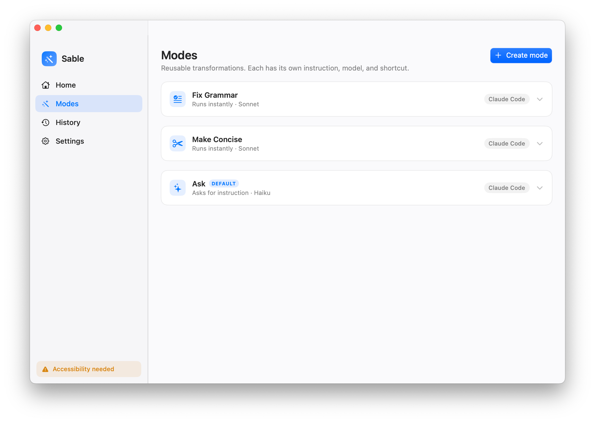

<div align="center">

# ✨ Sable

**Rewrite any selected text with Claude or Codex — right where you're typing.**

*Select it, hit a shortcut, paste the result.*

<br>



</div>

Sable is a macOS Dock app for fast AI text edits. Select text in any app, press a
shortcut, and a Superwhisper-style popup runs your chosen agent and drops the
rewrite on your clipboard — no window-switching, no copy-paste dance.

- **⚡ Instant modes** — fire-and-forget transforms like *Fix Grammar* or *Make Concise* that run the moment the popup opens
- **💬 Ask modes** — type a one-off instruction ("translate to French", "make it punchier") and watch the `Thinking…` indicator
- **🎛️ Claude or Codex** — pick the harness and model per mode, riff-style
- **⌨️ Your shortcuts** — a recordable hotkey for every mode, plus a global quick-popup key
- **🪄 Up to 6 modes** — tune each one's instruction, icon, model, and behavior in-app
- **🕘 History** — every run with its selection, output, and status
- **🔒 Local** — drives the `claude` / `codex` CLIs you already have; settings are plain JSON you can git track

---

## 📦 Build

Requires **macOS 13+** and the [Claude Code](https://docs.claude.com/en/docs/claude-code) (`claude`) and/or [Codex](https://github.com/openai/codex) (`codex`) CLI on your `PATH`.

```sh
git clone <your-fork> sable-macos
cd sable-macos
make build      # creates ./Sable.app (release)
make run        # build + launch
```

`make build` assembles and ad-hoc-signs `Sable.app` in the repo root. Use
`make CONFIG=debug build` for a debug bundle.

## 🚀 Quick Start

```sh
make run
```

1. Grant **Accessibility** when prompted (Settings → Privacy & Security → Accessibility).
2. Select text in any app.
3. Press **⌃⌥⌘Space** — type an instruction, then **⏎**.
4. Paste the rewrite with **⌘V**.

## 🪄 How it works

```
 select text  →  ⌃⌥⌘Space  →  type instruction  →  ⏎  →  agent rewrites  →  📋 clipboard
```

The popup shows the selection on top, an instruction field in the middle, and a
live status below. Instant modes skip the typing and run on open.

| Key | Action |
|-----|--------|
| `⏎` | Run the mode |
| `esc` | Cancel the run / close (restores your clipboard) |
| mode chip | Switch modes without closing |

## 🎚️ Modes

Open **Modes** to create and edit up to **6** transformations. Each has its own
instruction, icon, harness (Claude/Codex), model, optional "ask for instruction"
toggle, and recordable shortcut. Ships with three:

| Mode | What it does | Waits for input? |
|------|--------------|:----------------:|
| **Fix Grammar** | Fixes spelling/grammar, trims filler, keeps tone | — |
| **Make Concise** | Shortens while preserving meaning | — |
| **Ask** | Whatever you type (default popup mode) | ✓ |

## ⚙️ Settings

Everything is editable in-app and auto-saves to plain JSON:

```
~/.config/sable/settings.json
```

| Setting | Description |
|---------|-------------|
| Quick popup shortcut | Global hotkey, seeded to `⌃⌥⌘Space` |
| Default popup mode | Which mode the quick popup opens with |
| Claude / Codex path | Explicit binary path, or blank to search `PATH` |
| Working directory | Where the CLI runs (defaults to `~`) |
| Timeout | Max seconds to wait for a run |

Keyboard shortcuts are recorded inline in the **Modes** and **Settings** panes.

## 🔐 Permissions

| Permission | Why | Required |
|------------|-----|:--------:|
| **Accessibility** | Read the current text selection | ✓ |
| **Screen Recording** | Attach a screenshot for visual context | optional |

Grant both from **Settings** — status refreshes live, no relaunch needed.

> **Heads up:** Sable is ad-hoc signed, so each rebuild changes its signature and
> macOS resets the Accessibility grant. Re-enable Sable in Accessibility after
> `make build` if the popup stops capturing.

## 🛠️ Make targets

| Command | Does |
|---------|------|
| `make build` | Assemble + sign `./Sable.app` |
| `make run` | Build and launch |
| `make test` | Run the test suite |
| `make install` | Copy to `/Applications/Sable.app` (override with `INSTALL_DIR=`) |
| `make clean` | Remove build artifacts |

The app icon can be regenerated with `swift scripts/make-icon.swift out.png`.

---

> Personal hack built for my own workflow. Fork and adapt.
